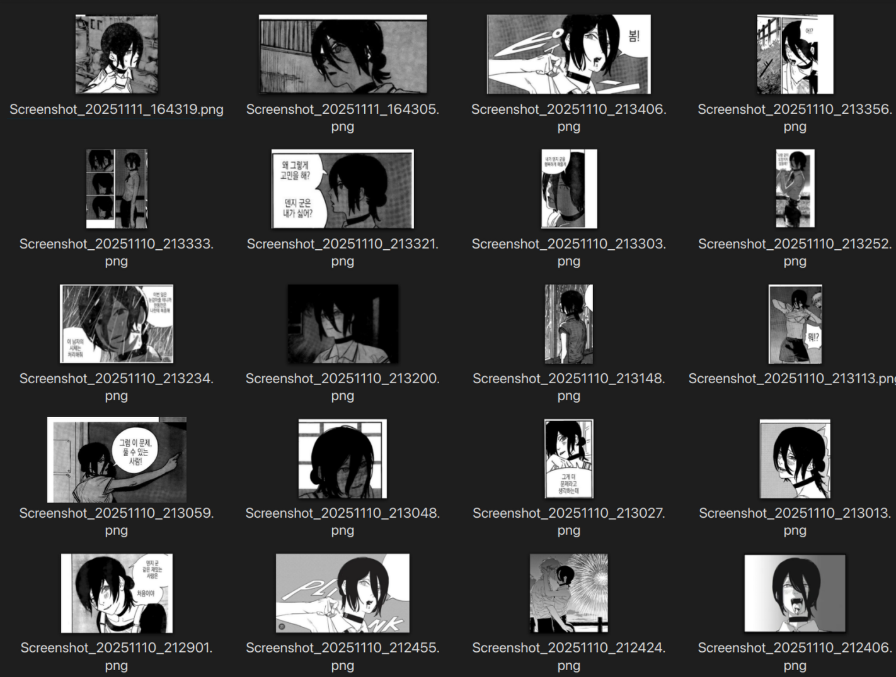
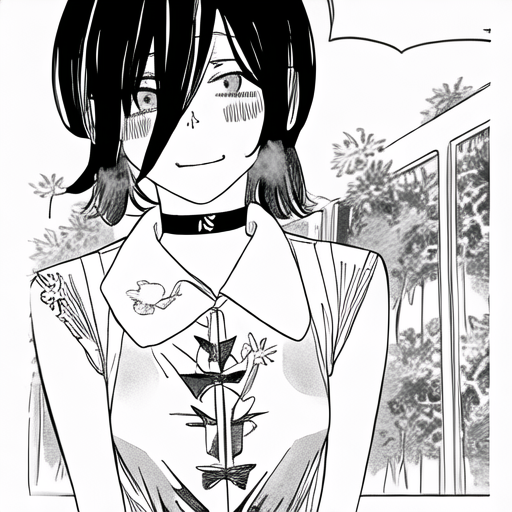

# LoRA Character Training Pipeline


만화/웹툰 캐릭터를 학습시키는 **자동화된 LoRA 파인튜닝 파이프라인**

> 만화 스크린샷만 넣으면 자동으로 텍스트 제거, 캐릭터 크롭, LoRA 학습까지 원클릭!

## 주요 기능

- **자동 데이터셋 전처리**: 만화 스크린샷에서 캐릭터 자동 크롭
- **텍스트/말풍선 제거**: OCR 기반 텍스트 감지 + Inpainting 제거
- **캐릭터 전신 감지**: 배경 제거 기반 전신 크롭
- **LoRA 파인튜닝**: Stable Diffusion 모델 경량화 학습
- **자동 추론**: 학습된 모델로 이미지 생성

## 예시

### 입력 데이터셋
만화 스크린샷 20장으로 학습 (체인소맨 - 레제)



### 생성 결과
학습된 모델로 생성한 이미지



**프롬프트:** `sks, a manga girl with black hair and a white shirt, get a flower, mangastyle, monochrome,black and white, grayscale`

**설정:** `200 epochs`, `learning_rate=3e-5`, `lora_r=32`

## 설치

```bash
# 1. 레포지토리 클론
git clone <repo-url>
cd lora

# 2. 가상환경 생성 (권장)
python -m venv venv
source venv/bin/activate  # Windows: venv\Scripts\activate

# 3. 의존성 설치
pip install -r requirement.txt
```

## 사용 방법

### 1단계: 데이터셋 준비

```bash
# dataset 폴더에 만화/웹툰 스크린샷 넣기
mkdir -p dataset
cp /path/to/screenshots/*.png dataset/
```

**데이터셋 요구사항:**
- 형식: PNG, JPG, JPEG, WEBP
- 권장 개수: 20-50장
- 내용: 같은 캐릭터가 나오는 만화 컷
- 자동 처리: 텍스트, 말풍선, 여러 캐릭터 → 자동으로 크롭됨

### 2단계: 학습

```bash
python train.py
```

**학습 과정:**
1. 자동 전처리 (캐릭터 크롭, 텍스트 제거)
2. 모델 로딩 (stablediffusionapi/anything-v5)
3. LoRA 파인튜닝 (150 epochs)
4. 모델 저장 (`my_lora_model/`)

**학습 설정 변경:**

`train.py`의 `Config` 클래스 수정:

```python
class Config:
    # 학습
    num_epochs = 100          # 에폭 수 (50-200 권장)
    learning_rate = 5e-5      # 학습률

    # LoRA
    lora_r = 32               # LoRA rank (8-64)
    lora_alpha = 64           # LoRA alpha

    # 데이터
    raw_dataset_path = "./dataset"
    clean_dataset_path = "./dataset_clean"
```

### 3단계: 이미지 생성

```bash
# 기본 사용
python generate.py

# 커스텀 프롬프트
python generate.py --prompt "smiling, outdoor, running"

# 여러 이미지 생성
python generate.py --num_images 5

# 고품질 생성
python generate.py --steps 50 --guidance_scale 9.0
```

**주요 옵션:**
- `--prompt`: 프롬프트 (자동으로 "sks girl" 추가됨)
- `--negative_prompt`: 네거티브 프롬프트
- `--num_images`: 생성할 이미지 수
- `--steps`: 추론 스텝 (20-50 권장)
- `--guidance_scale`: CFG scale (7-10 권장)
- `--seed`: 랜덤 시드 (재현성)
- `--lora_path`: LoRA 모델 경로

**예시:**
```bash
# 웃고 있는 캐릭터
python generate.py --prompt "smiling, happy expression"

# 특정 시드로 재생성
python generate.py --seed 42

# 다른 체크포인트 사용
python generate.py --lora_path my_lora_model_epoch50
```

## FastAPI 서버

LoRA 학습 및 이미지 생성 기능을 RESTful API로 제공합니다.

### 설치

`requirements.txt`에 추가된 `fastapi`와 `uvicorn`을 설치합니다.

```bash
pip install -r requirements.txt
```

### 서버 실행

프로젝트 루트 디렉토리에서 다음 명령어를 실행합니다.

```bash
# 개발 모드 (자동 재시작)
uvicorn main:app --reload --host 0.0.0.0 --port 8000

# 또는 Python으로 직접 실행
python main.py
```

서버는 `http://127.0.0.1:8000`에서 실행되며, API 문서는 `http://127.0.0.1:8000/docs`에서 확인할 수 있습니다.

### 주요 기능

- **실시간 진행률 추적**: 학습 및 이미지 생성의 진행 상태를 실시간으로 확인 가능
  - 학습: 전처리 단계, 에포크별 진행도 추적
  - 이미지 생성: step별 진행도 추적
- **CORS 지원**: Vue.js 등 프론트엔드에서 직접 API 호출 가능
- **정적 파일 서빙**: 생성된 이미지를 `/static/` 경로로 제공
- **동시 작업 방지**: Thread Lock으로 한 번에 하나의 학습/생성만 진행
- **백그라운드 작업**: 학습과 이미지 생성이 백그라운드에서 비동기로 실행됨

### API 엔드포인트 상세

*   **`GET /`**
    *   **설명**: 서버 상태를 확인합니다.
    *   **성공 응답 (200)**:
        ```json
        {
          "message": "LoRA FastAPI server is running."
        }
        ```

*   **`POST /train`**
    *   **설명**: LoRA 모델 학습을 시작합니다. 학습은 백그라운드에서 실행됩니다.
    *   **요청 본문**:
        ```json
        {
          "raw_dataset_path": "./dataset",
          "output_dir": "my_lora_model",
          "skip_preprocessing": false
        }
        ```
    *   **성공 응답 (200)**:
        ```json
        {
          "message": "Training started in the background. Check /train/status for progress."
        }
        ```
    *   **에러 응답 (400)**: 이미 학습이 진행 중일 때 발생합니다.
        ```json
        {
          "message": "Training is already in progress."
        }
        ```

*   **`GET /train/status`**
    *   **설명**: 현재 학습 진행 상태를 **실시간**으로 확인합니다. 프론트엔드에서 이 엔드포인트를 폴링하여 진행률을 표시할 수 있습니다.
    *   **성공 응답 (200)**: 여러 상태에 대한 예시입니다.
        *   대기 중:
            ```json
            {
              "status": "IDLE",
              "progress": {
                "phase": "",
                "current_epoch": 0,
                "total_epochs": 0
              },
              "message": "대기 중"
            }
            ```
        *   전처리 중:
            ```json
            {
              "status": "PREPROCESSING",
              "progress": {
                "phase": "preprocessing",
                "current_epoch": 0,
                "total_epochs": 0
              },
              "message": "데이터셋 전처리 중..."
            }
            ```
        *   학습 진행 중:
            ```json
            {
              "status": "TRAINING",
              "progress": {
                "phase": "training",
                "current_epoch": 50,
                "total_epochs": 250
              },
              "message": "학습 진행 중... (50/250 에포크 완료)"
            }
            ```
        *   학습 완료:
            ```json
            {
              "status": "SUCCESS",
              "progress": {
                "phase": "",
                "current_epoch": 0,
                "total_epochs": 0
              },
              "message": "학습이 성공적으로 완료되었습니다."
            }
            ```
        *   학습 실패:
            ```json
            {
              "status": "FAIL",
              "progress": {
                "phase": "",
                "current_epoch": 0,
                "total_epochs": 0
              },
              "message": "학습 실패: Some error message"
            }
            ```
    *   **상태 값**:
        - `IDLE`: 대기 중
        - `PREPROCESSING`: 전처리 진행 중
        - `TRAINING`: 학습 진행 중 (에포크마다 업데이트)
        - `SUCCESS`: 학습 완료
        - `FAIL`: 학습 실패

*   **`GET /train/stream`**
    *   **설명**: **Server-Sent Events (SSE)**를 사용하여 학습 진행률을 실시간으로 스트리밍합니다. 폴링 없이 서버가 자동으로 상태 업데이트를 푸시합니다.
    *   **사용법**: JavaScript의 `EventSource` API를 사용하여 연결합니다.
        ```javascript
        const eventSource = new EventSource('http://localhost:8000/train/stream');
        eventSource.onmessage = (event) => {
          const status = JSON.parse(event.data);
          console.log(status);
        };
        ```
    *   **응답 형식**: `text/event-stream` (SSE 스트림)
    *   **참고**:
        - 학습이 완료되거나 실패하면 자동으로 스트림이 종료됩니다.
        - 상태가 변경될 때마다 업데이트를 전송합니다.

*   **`POST /generate`**
    *   **설명**: 프롬프트를 기반으로 이미지 생성을 시작합니다. 이미지 생성은 백그라운드에서 실행됩니다.
    *   **요청 본문**:
        ```json
        {
          "prompt": "1girl, black hair, long hair, black and white manga style",
          "lora_path": "my_lora_model/checkpoint-250",
          "num_images": 2,
          "steps": 40,
          "guidance_scale": 7.5
        }
        ```
    *   **성공 응답 (200)**:
        ```json
        {
          "message": "Image generation started in the background. Check /generate/status for progress."
        }
        ```
    *   **에러 응답 (400)**: 이미 이미지 생성이 진행 중일 때 발생합니다.
        ```json
        {
          "message": "Image generation is already in progress."
        }
        ```
    *   **에러 응답 (404)**: LoRA 모델을 찾을 수 없을 때 발생합니다.
        ```json
        {
          "message": "LoRA model not found at my_lora_model. Please train the model first."
        }
        ```

*   **`GET /generate/status`**
    *   **설명**: 현재 이미지 생성 진행 상태를 **실시간**으로 확인합니다. step별 진행률을 추적할 수 있습니다.
    *   **성공 응답 (200)**: 여러 상태에 대한 예시입니다.
        *   대기 중:
            ```json
            {
              "status": "IDLE",
              "progress": {
                "current_image": 0,
                "total_images": 0,
                "current_step": 0,
                "total_steps": 0
              },
              "message": "대기 중"
            }
            ```
        *   생성 진행 중:
            ```json
            {
              "status": "GENERATING",
              "progress": {
                "current_image": 1,
                "total_images": 3,
                "current_step": 20,
                "total_steps": 40
              },
              "message": "이미지 1/3 생성 중... (step 20/40)"
            }
            ```
        *   생성 완료:
            ```json
            {
              "status": "SUCCESS",
              "progress": {
                "current_image": 0,
                "total_images": 0,
                "current_step": 0,
                "total_steps": 0
              },
              "message": "이미지 생성 완료 (3개)"
            }
            ```
        *   생성 실패:
            ```json
            {
              "status": "FAIL",
              "progress": {
                "current_image": 0,
                "total_images": 0,
                "current_step": 0,
                "total_steps": 0
              },
              "message": "이미지 생성 실패: Some error message"
            }
            ```
    *   **상태 값**:
        - `IDLE`: 대기 중
        - `GENERATING`: 이미지 생성 중 (step별 실시간 업데이트)
        - `SUCCESS`: 생성 완료
        - `FAIL`: 생성 실패
    *   **참고**:
        - 생성이 완료되면 `status`에 `image_urls` 필드가 추가되어 생성된 이미지 URL 목록이 포함됩니다.
        - 생성된 이미지는 `outputs/` 폴더에 저장됩니다.
        - `/static/` 경로를 통해 브라우저에서 직접 접근 가능합니다.
        - CORS가 설정되어 있어 Vue.js 등의 프론트엔드에서 이미지 로드 가능합니다.

*   **`GET /generate/stream`**
    *   **설명**: **Server-Sent Events (SSE)**를 사용하여 이미지 생성 진행률을 실시간으로 스트리밍합니다. step별 진행도를 폴링 없이 받을 수 있습니다.
    *   **사용법**: JavaScript의 `EventSource` API를 사용하여 연결합니다.
        ```javascript
        const eventSource = new EventSource('http://localhost:8000/generate/stream');
        eventSource.onmessage = (event) => {
          const status = JSON.parse(event.data);
          console.log(`Step: ${status.progress.current_step}/${status.progress.total_steps}`);
        };
        ```
    *   **응답 형식**: `text/event-stream` (SSE 스트림)
    *   **참고**:
        - 이미지 생성이 완료되거나 실패하면 자동으로 스트림이 종료됩니다.
        - 상태가 변경될 때마다 업데이트를 전송합니다 (약 0.3초마다 체크).
        - 생성 완료 시 `image_urls` 필드에 생성된 이미지 URL 목록이 포함됩니다.

### 진행률 추적 사용 예시

**Server-Sent Events (SSE)**를 사용하여 **폴링 없이** 서버가 자동으로 진행률을 푸시합니다.

#### JavaScript (학습 진행률 추적 - SSE 방식)

```javascript
// 학습 시작 및 실시간 진행률 추적
async function startTraining() {
  // 1. 학습 시작
  const response = await fetch('http://localhost:8000/train', {
    method: 'POST',
    headers: { 'Content-Type': 'application/json' },
    body: JSON.stringify({
      raw_dataset_path: './dataset',
      output_dir: 'my_lora_model',
      skip_preprocessing: false
    })
  });
  const data = await response.json();
  console.log(data.message);

  // 2. SSE로 실시간 진행률 받기 (폴링 불필요!)
  const eventSource = new EventSource('http://localhost:8000/train/stream');

  eventSource.onmessage = (event) => {
    const status = JSON.parse(event.data);
    console.log(`상태: ${status.status}`);
    console.log(`메시지: ${status.message}`);

    if (status.status === 'TRAINING') {
      const { current_epoch, total_epochs } = status.progress;
      const progress = (current_epoch / total_epochs * 100).toFixed(1);
      console.log(`진행률: ${progress}% (${current_epoch}/${total_epochs} 에포크)`);

      // UI 업데이트 예시
      document.getElementById('progress').style.width = `${progress}%`;
      document.getElementById('status').textContent = status.message;
    }

    // 완료 또는 실패 시 자동으로 연결 종료됨
    if (status.status === 'SUCCESS' || status.status === 'FAIL') {
      console.log('학습 종료:', status.message);
      eventSource.close();
    }
  };

  eventSource.onerror = (error) => {
    console.error('SSE 연결 오류:', error);
    eventSource.close();
  };
}
```

#### JavaScript (이미지 생성 진행률 추적 - SSE 방식)

```javascript
// 이미지 생성 시작 및 실시간 진행률 추적
async function startGeneration() {
  // 1. 이미지 생성 시작
  const response = await fetch('http://localhost:8000/generate', {
    method: 'POST',
    headers: { 'Content-Type': 'application/json' },
    body: JSON.stringify({
      prompt: 'a beautiful girl',
      lora_path: 'my_lora_model/checkpoint-250',
      num_images: 3,
      steps: 40
    })
  });
  const data = await response.json();
  console.log(data.message);

  // 2. SSE로 실시간 진행률 받기 (폴링 불필요!)
  const eventSource = new EventSource('http://localhost:8000/generate/stream');

  eventSource.onmessage = (event) => {
    const status = JSON.parse(event.data);

    if (status.status === 'GENERATING') {
      const { current_image, total_images, current_step, total_steps } = status.progress;
      console.log(`이미지: ${current_image}/${total_images}`);
      console.log(`Step: ${current_step}/${total_steps}`);

      const imageProgress = (current_image / total_images * 100).toFixed(1);
      const stepProgress = (current_step / total_steps * 100).toFixed(1);
      console.log(`전체 진행률: ${imageProgress}%, 현재 이미지: ${stepProgress}%`);

      // UI 업데이트 예시
      document.getElementById('image-progress').textContent = `${current_image}/${total_images}`;
      document.getElementById('step-progress').style.width = `${stepProgress}%`;
    }

    // 완료 시 이미지 URL 가져오기
    if (status.status === 'SUCCESS') {
      console.log('생성 완료!');
      console.log('이미지 URLs:', status.image_urls);
      eventSource.close();

      // 이미지 표시 예시
      status.image_urls.forEach(url => {
        const img = document.createElement('img');
        img.src = url;
        document.getElementById('results').appendChild(img);
      });
    }

    // 실패 시 연결 종료
    if (status.status === 'FAIL') {
      console.error('생성 실패:', status.message);
      eventSource.close();
    }
  };

  eventSource.onerror = (error) => {
    console.error('SSE 연결 오류:', error);
    eventSource.close();
  };
}
```

#### 기존 방식 (폴링) 사용하기

SSE를 사용할 수 없는 환경에서는 `/train/status` 및 `/generate/status` 엔드포인트를 폴링하여 상태를 확인할 수 있습니다.

```javascript
// 폴링 방식 예시 (1초마다 상태 확인)
async function pollTrainingStatus() {
  const interval = setInterval(async () => {
    const response = await fetch('http://localhost:8000/train/status');
    const status = await response.json();

    // 상태 처리 로직...

    if (status.status === 'SUCCESS' || status.status === 'FAIL') {
      clearInterval(interval);
    }
  }, 1000);
}
```

## 프로젝트 구조

```
lora/
├── .git/                 # Git 저장소 파일
├── .gitignore            # Git 무시 파일
├── core/                 # 학습, 생성, 전처리를 위한 핵심 모듈
│   ├── __init__.py
│   ├── config.py         # 설정 파일
│   ├── generate.py       # 이미지 생성 로직
│   ├── preprocess.py     # 데이터셋 전처리 로직
│   └── train.py          # 학습 로직
├── dataset/              # 원본 데이터셋 (만화 스크린샷)
├── dataset_clean/        # 전처리된 데이터셋 (자동 생성)
├── example/              # 예시 이미지 (데이터셋 샘플, 생성 결과)
│   ├── dataset.png       # 원본 데이터셋 예시
│   └── reze.png          # 생성 결과 예시
├── generate.py           # 이미지 생성을 위한 메인 스크립트
├── main.py               # FastAPI 애플리케이션 엔트리포인트
├── outputs/              # 생성된 이미지
├── my_lora_model/        # 학습된 LoRA 모델 (예: my_lora_model_epoch100)
├── README.md             # 프로젝트 README 파일
├── requirements.txt      # Python 의존성
├── train.py              # 학습을 위한 메인 스크립트 (전처리 포함)
└── venv/                 # Python 가상 환경
```

## 전처리 동작 방식

### 자동 처리 단계

1. **텍스트 감지**: OCR (EasyOCR)로 말풍선/텍스트 위치 파악
2. **텍스트 제거**: Inpainting으로 텍스트 영역 자동 제거
3. **캐릭터 감지**: 배경 제거 (rembg)로 캐릭터 영역 탐지
4. **스마트 크롭**: 캐릭터 중심으로 bbox 확장 (전신 포함)
5. **리사이즈**: 512x512 정사각형 (종횡비 유지, 패딩 추가)

## 학습 팁

### 데이터셋 품질

- ✅ **좋은 데이터**: 캐릭터 얼굴/전신이 잘 보이는 컷
- ❌ **나쁜 데이터**: 캐릭터가 가려지거나 흐릿한 컷

### 하이퍼파라미터 튜닝

**작은 데이터셋 (10-20장):**
- `num_epochs = 150-200`
- `lora_r = 32-64`
- `learning_rate = 5e-5`

**큰 데이터셋 (50-100장):**
- `num_epochs = 50-100`
- `lora_r = 16-32`
- `learning_rate = 1e-5`

**과적합 증상:**
- Loss가 계속 감소하지만 생성 이미지 품질이 떨어짐
- 해결: Epoch 수 줄이기, Learning rate 낮추기

**과소적합 증상:**
- 캐릭터가 원본과 많이 다름
- 해결: Epoch 수 늘리기, LoRA rank 높이기

## 기술 스택

### Deep Learning & AI


### Model & Fine-tuning


### Preprocessing


## 트러블슈팅

### Q: 전처리가 실패함 (캐릭터 감지 안됨)

**A:** 배경이 너무 복잡하거나 캐릭터가 작은 경우 발생합니다.
- 해결: 수동으로 크롭하거나 다른 이미지를 사용하세요.

### Q: 생성된 이미지가 깨져있거나 노이즈가 많음

**A:** 데이터셋에 텍스트/말풍선이 제대로 제거되지 않았을 수 있습니다.
- 해결: `dataset_clean/` 폴더를 확인해 전처리가 제대로 됐는지 체크하세요.
- 전처리를 다시 실행하려면: `rm -rf dataset_clean && python train.py`

### Q: CUDA out of memory 에러

**A:** GPU 메모리 부족입니다.
```python
# train.py Config 수정
gradient_accumulation_steps = 2  # 1 → 2로 변경
# 또는 이미지 크기 축소
image_size = 512  # → 384
```

### Q: 학습이 너무 느림

**A:** GPU 사용을 확인하세요:
```bash
nvidia-smi  # GPU 사용 확인
```

## 라이센스

MIT License

## 참고 자료

- [LoRA 논문](https://arxiv.org/abs/2106.09685)
- [Diffusers 문서](https://huggingface.co/docs/diffusers)
- [PEFT 라이브러리](https://github.com/huggingface/peft)
- [Anything v5 모델](https://huggingface.co/stablediffusionapi/anything-v5)
- [EasyOCR](https://github.com/JaidedAI/EasyOCR)
- [rembg](https://github.com/danielgatis/rembg)
